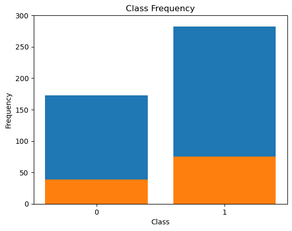
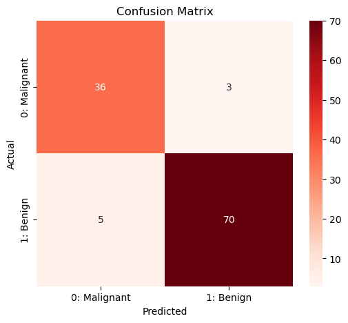

# **Breast Cancer Diagnosis Using Wisconsin Dataset | Logistic Regression**  


## **Introduction**  
Breast cancer is one of the most common types of cancer worldwide. Early diagnosis is critical for effective treatment and patient survival. This project leverages **Logistic Regression**, a simple yet powerful classification algorithm, to predict whether a tumor is **benign (non-cancerous) or malignant (cancerous)** based on **biopsy sample features**.  

---

## **Problem Statement**  
Given **biopsy-derived measurements** of breast tumors, the goal is to develop a machine learning model that can **accurately classify tumors** as either **benign (0) or malignant (1)** using **Logistic Regression**.  

### **Key Challenges**:  
1. Identifying **relevant features** for classification.  
2. Handling **imbalanced data** (if applicable).  
3. Evaluating **model performance** using accuracy, precision, recall, and ROC-AUC.  

---

## **Dataset**  
### **Breast Cancer Wisconsin Dataset**  
- **Source**: UCI Machine Learning Repository  
- **Features**: 30 numeric attributes extracted from **cell nuclei** in biopsy samples.  
- **Target Variable**:  
  - `0` → **Benign** (Non-cancerous)  
  - `1` → **Malignant** (Cancerous)  

### **Sample Features**:  
- **Mean Radius, Mean Texture, Mean Perimeter, Mean Area, Mean Smoothness, etc.**  
- **Worst and Standard Error values for these features.**  



---

## **Exploratory Data Analysis (EDA)**  
### **1. Data Distribution**  
- **Histogram & KDE plots** to understand feature distributions.  
```python
import seaborn as sns
import matplotlib.pyplot as plt

sns.histplot(data['mean radius'], kde=True, bins=30)
plt.title("Distribution of Mean Radius")
plt.show()
```
- **Key Finding**: Some features exhibit **distinct patterns** between benign and malignant tumors.  

### **2. Correlation Analysis**  
- **Heatmap** to visualize feature relationships.  
```python
import seaborn as sns
import matplotlib.pyplot as plt

plt.figure(figsize=(12, 8))
sns.heatmap(data.corr(), cmap='coolwarm', annot=False)
plt.title("Feature Correlation Heatmap")
plt.show()
```
- **Key Finding**: Some features are **highly correlated**, which may impact model performance.  

---

## **Modeling Approach**  
### **1. Data Preprocessing**  
- **Handling Missing Values** (if any).  
- **Feature Scaling** using **StandardScaler**.  
- **Splitting Data** into **Training (80%)** and **Testing (20%)** sets.  

### **2. Logistic Regression Model**  
- Logistic Regression is used due to its effectiveness in **binary classification problems**.  
```python
from sklearn.linear_model import LogisticRegression
from sklearn.model_selection import train_test_split
from sklearn.preprocessing import StandardScaler

# Splitting dataset
X_train, X_test, y_train, y_test = train_test_split(X, y, test_size=0.2, random_state=42)

# Feature Scaling
scaler = StandardScaler()
X_train_scaled = scaler.fit_transform(X_train)
X_test_scaled = scaler.transform(X_test)

# Training Model
model = LogisticRegression()
model.fit(X_train_scaled, y_train)
```



### **3. Model Evaluation**  
- **Accuracy, Precision, Recall, F1-score, ROC-AUC** metrics.  
```python
from sklearn.metrics import classification_report, confusion_matrix, roc_auc_score

y_pred = model.predict(X_test_scaled)
print(classification_report(y_test, y_pred))
```
- **ROC Curve to visualize classification performance.**  
```python
from sklearn.metrics import roc_curve, auc

y_prob = model.predict_proba(X_test_scaled)[:,1]
fpr, tpr, _ = roc_curve(y_test, y_prob)
roc_auc = auc(fpr, tpr)

plt.figure(figsize=(8,6))
plt.plot(fpr, tpr, label=f'ROC curve (area = {roc_auc:.2f})')
plt.plot([0, 1], [0, 1], linestyle='--', color='gray')
plt.xlabel("False Positive Rate")
plt.ylabel("True Positive Rate")
plt.title("Receiver Operating Characteristic (ROC) Curve")
plt.legend()
plt.show()
```
- **Key Findings**:  
  - **High accuracy & AUC score** indicate **strong classification performance**.  
  - Model effectively differentiates between **benign & malignant tumors**.  

---

## **Conclusion**  
1. **Logistic Regression** effectively classifies tumors with high accuracy.  
2. Feature scaling improves model performance.  
3. The model can be further improved using **advanced ensemble methods** (e.g., Random Forest, XGBoost).  
